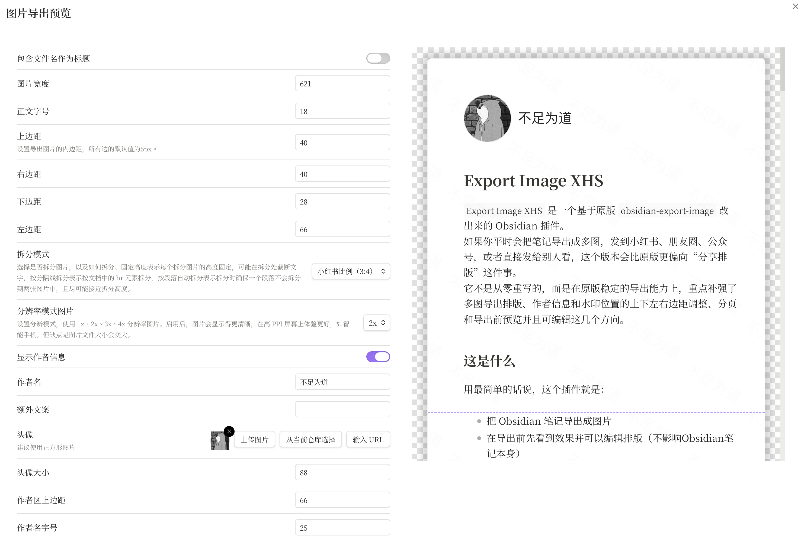
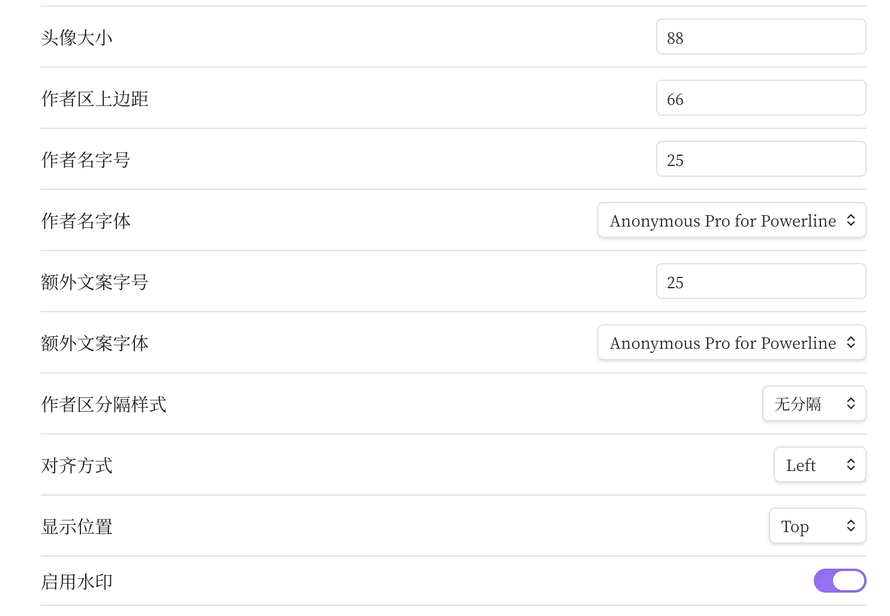
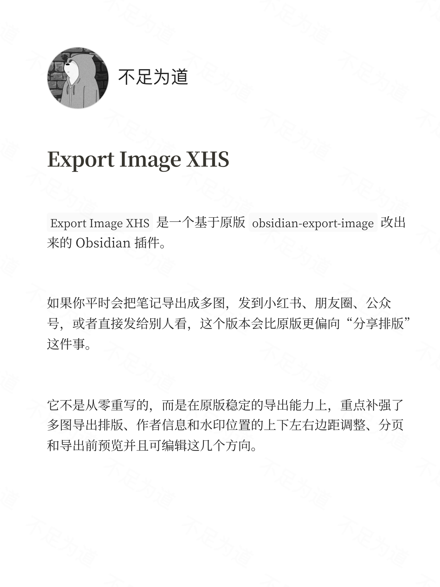
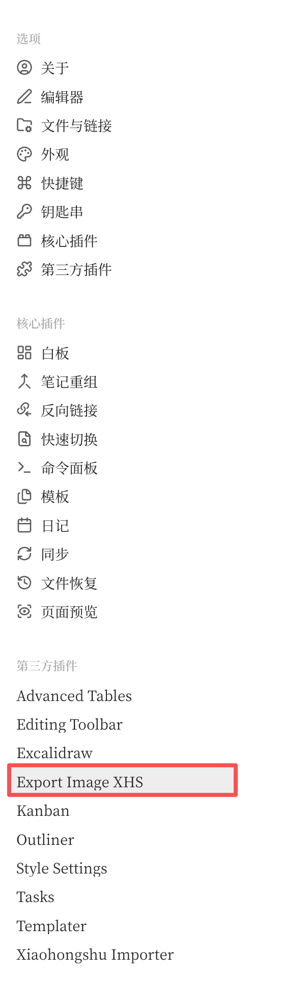

# Export Image XHS

`Export Image XHS` 是一个基于原版 `obsidian-export-image` 改出来的 Obsidian 插件。

如果你平时会把笔记导出成多图，发到小红书、朋友圈、公众号，或者直接发给别人看，这个版本会比原版更偏向“分享排版”这件事。

它不是从零重写的，而是在原版稳定的导出能力上，重点补强了多图导出排版、作者信息和水印位置的上下左右边距调整、分页和导出前预览并且可编辑这几个方向。

## 界面预览

### 导出面板与实时预览



### 参数设置区域



### 实际导出效果



### 插件已启用示例



## 这是什么

用最简单的话说，这个插件就是：

- 把 Obsidian 笔记导出成图片
- 在导出前先看到效果并可以编辑排版（不影响Obsidian笔记本身）
- 更适合做成能直接分享出去的多图、长图

原版更偏“通用导出工具”，这一版更偏“适合内容分享的多图导出工具”，并且内置了更偏向小红书场景的预设比例和默认参数。

## 这版在原版基础上改了什么

下面这些是最核心、最容易感受到的差异。

### 1. 预览不只是看一眼，而是能直接排版

原版更像“看一下大概长什么样再导出”。

这一版把导出面板改得更像一个简单排版台：

- 打开导出弹窗后，可以直接看最终成品的效果
- 可以在预览阶段微调正文排版
- 预览和最终导出尽量保持一致，减少“看起来这样，导出来又是另一回事”的情况

这对经常导出多图的人很重要，因为最耗时间的往往不是“导出”，而是“反复试版”。

### 2. 默认参数改成更适合小红书多图

原版默认设置更通用，适合很多场景。

这一版把默认值往小红书多图分享场景调了一步，主要包括：

- 更适合 3:4 的多图比例
- 更适合阅读的留白
- 更偏向卡片式头部信息布局
- 更适合带作者信息和水印的分享图

简单说，就是你安装后不用调很多次，就更容易先得到一张“能看、能发”的图。

### 3. 作者信息区域更能调

这一版对顶部作者信息区域做了增强，可以更方便地做出类似分享卡片的头部效果。

可以调整的内容包括：

- 头像大小
- 名称字号
- 日期或备注字号
- 字体
- 对齐方式
- 分隔样式
- 位置和间距

如果你希望图片导出后看起来更像“成品图”，这一块会比原版更好用。

### 4. 水印支持更完整

这一版重点处理过水印相关问题，目标是：

- 预览里能看到的水印，导出时也要尽量保留
- 文字水印和图片水印都能用
- 多页导出时，水印不要莫名消失

如果你经常发公开内容，想保留自己的署名或品牌标识，这一点会比较实用。

### 5. 分页和导出结果更接近

原版在一些多图或分页场景下，可能会出现这些问题：

- 预览和导出不一致
- 分页位置不理想
- 作者区和正文在分页时看起来不稳定
- 个别页面出现空白或排版异常

这一版针对这些问题做了集中调整，重点就是让：

- 分页线更接近真正导出的分页位置
- 导出时的内容结构更稳定
- 多页导出更适合多图分享场景

## 这版重点适配了什么

这版不是“什么都想做”的通用插件，它目前重点适配的是下面这些方向：

- 中文内容排版
- 小红书风格 3:4 多图
- 顶部带头像、昵称、日期的分享卡片风格
- 导出前先调版式，再导出
- 水印、分页、预览、导出尽量保持一致

如果你要的是：

- 直接把一篇笔记做成更像成品的分享多图
- 更适合长文阅读的留白和布局
- 更方便做个人风格化导出

那这版会比较合适。

如果你要的是：

- 尽量少改原版行为
- 更偏通用截图
- 不需要作者区、水印、长图排版这些增强

那原版可能更适合你。

## 保留了原版哪些能力

虽然这版做了定向修改，但原版的基础导出能力并没有被扔掉。

仍然保留了这些能力：

- 从当前笔记导出图片
- 复制到剪贴板
- 导出 PDF
- 多张图片导出
- 元数据导出
- 文件夹批量导出

所以它不是“另起炉灶”，而是在原版能力上继续往分享场景推进。

## 适合谁用

适合下面这些人：

- 用 Obsidian 写内容，想直接导出成多图分享
- 想让导出图带头像、昵称、日期、备注
- 想给图片加自己的文字或图片水印
- 想在导出前先把版式调顺眼
- 想更方便地把长文笔记导出成适合小红书的多图

## 安装方法

目前更适合手动安装。

### 方法一：直接安装构建好的文件

你需要这 3 个文件：

- `main.js`
- `manifest.json`
- `styles.css`

把它们放到你的 Obsidian 仓库目录下面：

```text
你的仓库/.obsidian/plugins/export-image-xhs/
```

例如：

```text
MyVault/.obsidian/plugins/export-image-xhs/
```

放好后：

1. 打开 Obsidian
2. 进入“设置” -> “第三方插件”
3. 打开 `Export Image XHS`

如果插件已经开着，重启一次 Obsidian 会更稳。

### 方法二：自己从源码构建

如果你会用命令行，可以在仓库根目录执行：

```bash
npm install
npm run build
```

构建完成后，仓库根目录会生成：

- `main.js`
- `manifest.json`
- `styles.css`

再把这 3 个文件复制到插件目录即可。

## 能不能和原版一起装

可以。

这个版本已经使用新的插件 id：

```text
export-image-xhs
```

所以它不会直接覆盖原版 `obsidian-export-image`。  
你可以两个版本都装，再决定自己更喜欢哪一个。

## 如果要分享给别人，怎么分享

最简单的方式就是把下面 3 个文件打包给别人：

- `main.js`
- `manifest.json`
- `styles.css`

对方只要把它们放进自己的：

```text
.obsidian/plugins/export-image-xhs/
```

然后在 Obsidian 里启用插件就可以了。

如果你准备长期维护，比较推荐：

1. 把仓库放到自己的 GitHub
2. 在 Release 里上传这 3 个构建文件
3. 在 README 里明确说明这是基于原版修改的版本

这样别人更容易知道这个插件适合什么场景，也更容易安装。

## 联网与文件访问说明

为了避免误解，这里把插件会做的事情说清楚：

- 当你主动输入远程图片 URL 作为头像或水印时，插件会请求这个图片地址
- 导出图片、PDF 或批量导出时，插件会把结果写入你的 vault 或本地导出目录
- 插件不会主动把你的笔记内容上传到开发者服务器

如果你不使用远程图片 URL，只使用本地图片或纯文字配置，那么插件本身不需要额外联网来完成主要导出功能。

## 原版项目

这个版本基于下面这个项目修改而来：

- 项目名：`obsidian-export-image`
- 作者：Zhou Hua
- 地址：https://github.com/zhouhua/obsidian-export-image

原项目提供了非常扎实的导出能力基础，这个版本是在它的基础上，继续往多图分享场景做适配。
